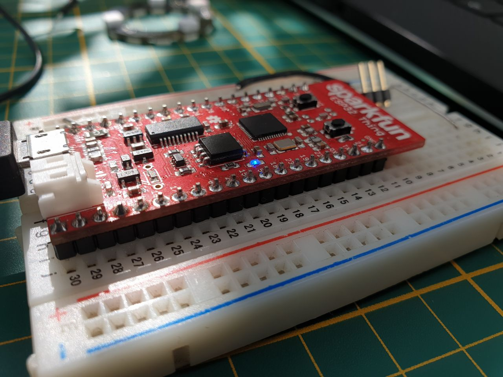
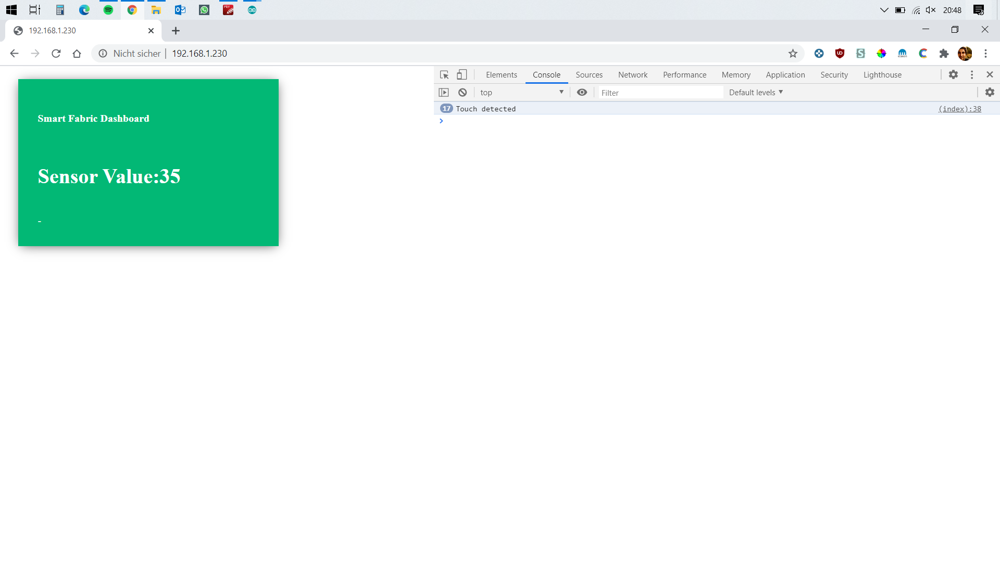

# smart-fabrics

This is my repo for my Theme 1 project in interactive systems at UdS 2020.

Implemented Webserver which serves a dashboard for live sensor value reading.
---
This project will be based on the sparcfun ESP32 Thing as microcontroller


---
I already got some outputs using the ESP32 as a server which connects via inbuilt wifi to the local network and serves some data.


There is already a dashboard page. The sensor value of T4 is passed using AJAX to display the values without refreshing the html page.

I tested also some thresholds which detects touch actions and display detection under the Sensor value in the green tile as also in the Java Script console (In the test configuration the sensor had value of about 35 without touching and about 5-15 if touched, depending on area and preassure of action)* [ ] 
```
if(touchVal < 25){
            console.log("Touch detected");
            document.getElementById("vis").innerHTML = "touched";
        }else{
            document.getElementById("vis").innerHTML = "-";
        }
```
