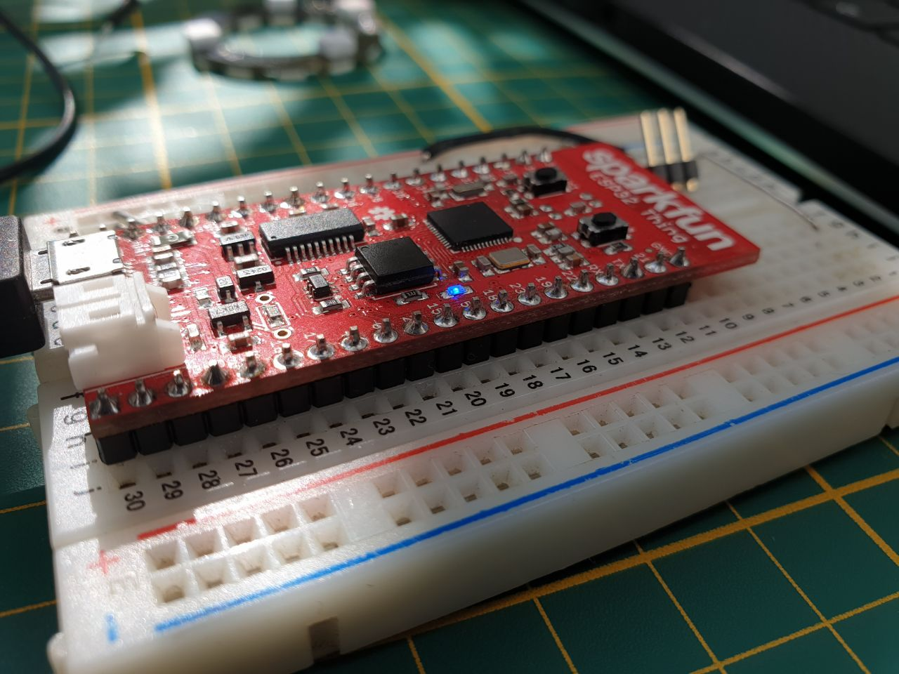
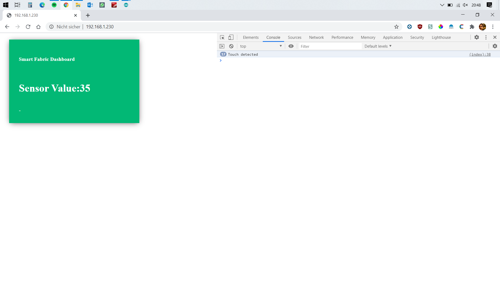
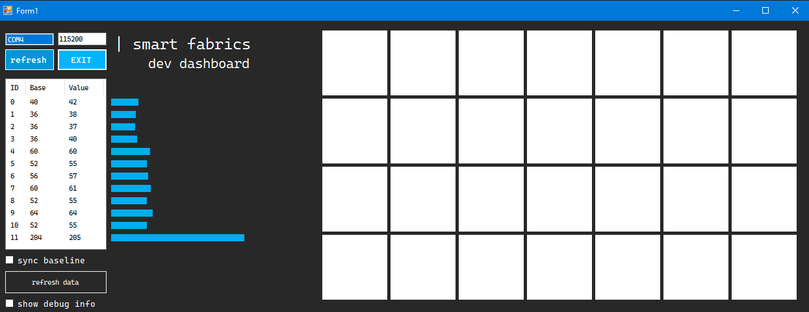

# smart-fabrics

Implemented Webserver which serves a dashboard for live sensor value reading.

## Getting started

This project will be based on the sparcfun ESP32 Thing as microcontroller



I choose this microcontroller over the an Arduino because of its wifi capabilities which I will use to serve a dashboard webpage to display and set values or modes.

## Dashboard

I already got some outputs using the ESP32 as a server which connects via inbuilt wifi to the local network and serves some data.


There is already a dashboard page. The sensor value of T4 is passed using AJAX to display the values without refreshing the html page.

I tested also some thresholds which detects touch actions and display detection under the Sensor value in the green tile as also in the Java Script console (In the test configuration the sensor had value of about 35 without touching and about 5-15 if touched, depending on area and preassure of action)* [ ]

```
if(touchVal < 25){
            console.log("Touch detected");
            document.getElementById("vis").innerHTML = "touched";
        }else{
            document.getElementById("vis").innerHTML = "-";
        }
```

I should mention here that the webserver may not be the best solution for this project. The code is still in the repository but will not be updated.
Instead a new dashboard came up:

## Windows Desktop Dashboard

Written in C# for Windows Forms. The dashboard provides ne important sensor values from the ESP32 and the MPR121.

### Connection

The connection is running via Serial Port. I managed to implement a very simple protocol. The MPR121 libary provides some useful arrays.
For all the 12 outputs there with ID 0 to 11 there are two arrays:

* baseline array where the "idle" values of the sensors are stored
* filtered values of the current state. The filter just flatten the values a bit.

I want to send all the baseline and the filtered values via serial to the desktop client.
As a pattern I thoght about a mask so I can catch the correct Lines from the buffer.

The pattern was: [ID]:[BASELINE]:[FILTERED] - so values with ":" as a seperator.
Data throgh Serial has byte datatype, but the values are intended to be integer values.

````
string s = serialPort1.ReadLine();
string[] spa = s.Split(':');
if (spa[0] == "x"){
            id = Convert.ToInt32(spa[1]);
            baseline = Convert.ToInt32(spa[2]);
            val = Convert.ToInt32(spa[3]);
            ...
}
````

The conversion is necessary to get interger values.
However the conversion of (int)0 was string(""). I extended my protocol with a starting character "x".

Now~~~~ i can catch exceptions with

````
if (spa[0] == "x")
...
````

Where spa[0] is the first element of my splittet line I read from the serial buffer.

\[x]:[ID]:[BASELINE]:[FILTERED]



